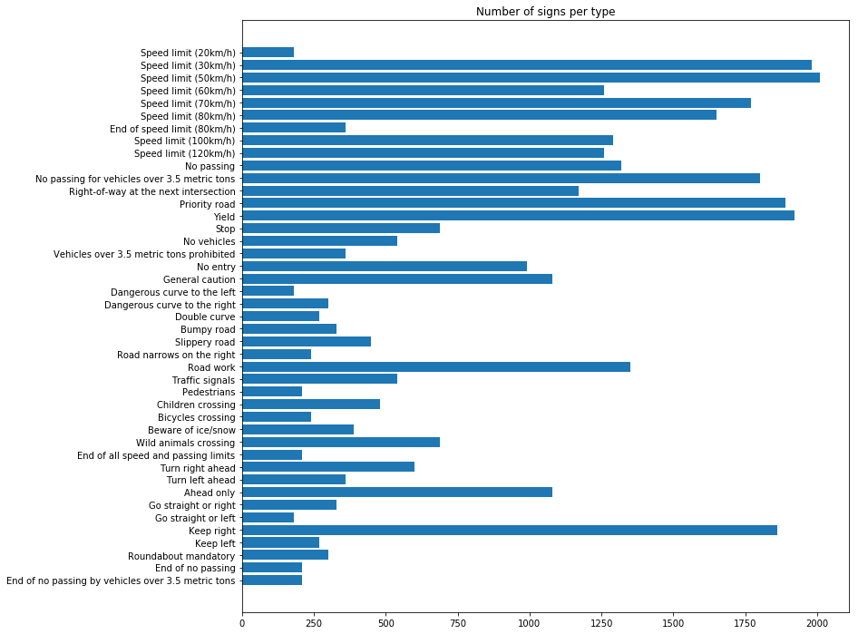
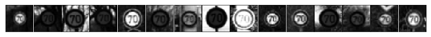

## Project: Build a Traffic Sign Recognition Program
[](http://www.udacity.com/drive)

*made by CJ*

---
The goal of this project is to identify German traffic signs using Google's Tensforflow

*Link to the project code [here](/Traffic_Sign_Classifier.ipynb)*

---

## Dataset Exploration
#### Dataset Summary

* Number of training examples = **34799**
* Number of testing examples = **12630**
* Image data shape = **(32, 32, 3)**
* Number of classes = **43**

#### Exploratory Visualization

##### The following are examples of 5 sign types:

* Speed limit (60km/h)   **1260 samples**


* End of no passing by vehicles over 3.5 metric tons   **210 samples**


* Speed limit (120km/h)   **1260 samples**


* Speed limit (20km/h)   **180 samples**


* End of no passing   **210 samples)**


##### The following shows the number of signs per types:
Note that the categories aren't even.  Additional data will be added from the existing set, and augmented,
to equalize the categories a bit.



## Design and Test a Model Architecture
#### Preprocessing

You pre-process all images in the architecture.
Only the additional images will be augmented.



### Dependencies
This lab requires:

* [CarND Term1 Starter Kit](https://github.com/udacity/CarND-Term1-Starter-Kit)

The lab environment can be created with CarND Term1 Starter Kit. Click [here](https://github.com/udacity/CarND-Term1-Starter-Kit/blob/master/README.md) for the details.

### Dataset and Repository

1. Download the data set. The classroom has a link to the data set in the "Project Instructions" content. This is a pickled dataset in which we've already resized the images to 32x32. It contains a training, validation and test set.
2. Clone the project, which contains the Ipython notebook and the writeup template.
```sh
git clone https://github.com/udacity/CarND-Traffic-Sign-Classifier-Project
cd CarND-Traffic-Sign-Classifier-Project
jupyter notebook Traffic_Sign_Classifier.ipynb
```

### Requirements for Submission
Follow the instructions in the `Traffic_Sign_Classifier.ipynb` notebook and write the project report using the writeup template as a guide, `writeup_template.md`. Submit the project code and writeup document.

## How to write a README
A well written README file can enhance your project and portfolio.  Develop your abilities to create professional README files by completing [this free course](https://www.udacity.com/course/writing-readmes--ud777).

