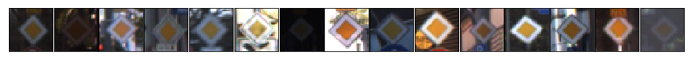
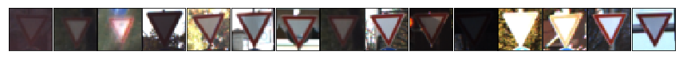
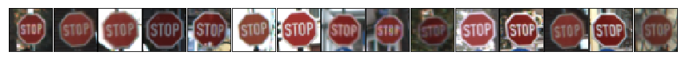
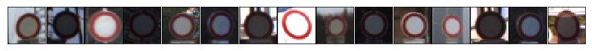
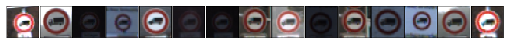
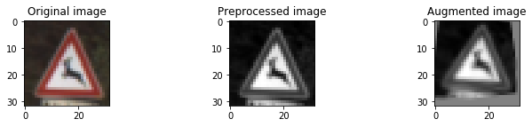
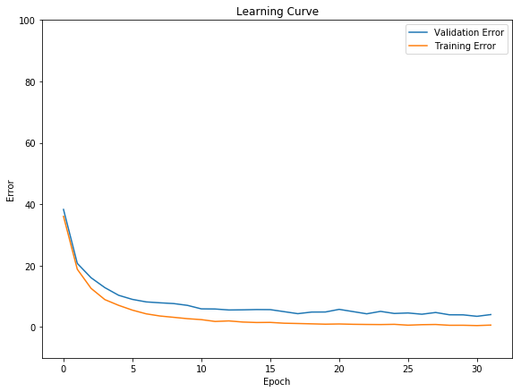
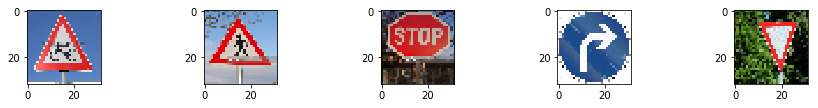

## Project: Build a Traffic Sign Recognition Program

*made by CJ*

---
The goal of this project is to identify German traffic signs using Google's Tensforflow

*Link to the project code [here](/Traffic_Sign_Classifier.ipynb)*

---

## Dataset Exploration
#### Dataset Summary

* Number of training examples = **34799**
* Number of testing examples = **12630**
* Image data shape = **(32, 32, 3)**
* Number of classes = **43**

#### Exploratory Visualization

##### The following are examples of 5 sign classes:

* Speed limit (60km/h)   **1260 samples**

* End of no passing by vehicles over 3.5 metric tons   **210 samples**

* Speed limit (120km/h)   **1260 samples**

* Speed limit (20km/h)   **180 samples**

* End of no passing   **210 samples)**

##### The following shows the number of signs per class:
*Note that the amount of images per class aren't remotely even.  The lacking classes will be padded with augmented images from the existing set.*

## Design and Test a Model Architecture
#### Preprocessing

All the images in the project will be pre-processed.  It includes:
* Normalization - to get your data on the same scale for easier learning
* Grayscale - to reduce complexity / the color doesn't provide much info

The "padded" images will be augmented.  They will be rotated, moved, and warped to provide an additional image for the training set.

#### Model Architecture
LeNet was used, because I have experience with it, and it is proven to be efficient.
I made some small adjustments:
* Added an additional convolutional layer
* Added a dropout filter to the fully connected layers

||Layer|Output|
|---|---|---|
|1|5x5 Convolution > RELU > 2 Stride Max Pool|14x14x6|
|2|5x5 Convolution > RELU > 2 Stride Max Pool|5x5x16|
|1|5x5 Convolution > RELU > 2 Stride Max Pool > Flatten|1x1x400|
|1|Fully Connected > RELU > Dropout|120|
|1|Fully Connected|84|
|1|Fully Connected|43|

#### Model Training
The Adam Optimization Algorithm is used, with a learning rate of 0.0005.
Anything higher, and the validation rate peeked too quickly.

The batch size is set to 160.

The epochs is set to 32.  Too much overfitting followed if this epoch was set higher.

This is the result of the learning process:

#### Solution Approach
First, I used the standard LeNet implementation, and obtained a validation set accuracy of about 0.8.
I added dropout filters, as well as an additional layer to Lenet, to boost the accuracy to 0.85.
I then pre-processed the images, and boosted the accuracy to about 0.9.
I padded image classes with small amounts of training data with augmented images, and boosted the accuracy to 0.93.
I lowered the learning rate to get the accuracy up to its final total of 0.96.

## Test a Model on New Images
### Acquiring New Images

### Performance on New Images
Name|Sign|Prediction|Success
---|---|---|---
bicycle|Bicycles crossing|Slippery road|False
pedestrian|Pedestrians|Pedestrians|True
stop.jpg|Stop|Bicycles crossing|False
turn-right.jpg|Turn right ahead|Turn right ahead|True
yield.jpg|Yield|Yield|True

A 60% accuracy was obtained from images from the web.
* The bicycle wasn't predicted correctly.  It is understandable, because the symbol is intricate, and blurred on a low quality image.
* The stop sign was also not predicted correcly, maybe because the sign isn't centered.

### Model Certainty - Softmax Probabilities

##### bicycle.jpg
* Slippery road	100%
* Dangerous curve to the left	0%
* Dangerous curve to the right	0%
* Beware of ice/snow	0%
* Road work	0%

#### pedestrian.jpg
* Pedestrians	98%
* Double curve	1%
* Road narrows on the right	1%
* Wild animals crossing	0%
* Speed limit (70km/h)	0%

#### stop.jpg
* Bicycles crossing	50%
* Beware of ice/snow	49%
* Priority road	1%
* Children crossing	0%
* Road work	0%

#### turn-right.jpg
* Turn right ahead	100%
* Right-of-way at the next intersection	0%
* Road work	0%
* Speed limit (100km/h)	0%
* Speed limit (80km/h)	0%

#### yield.jpg
* Yield	100%
* Go straight or left	0%
* No passing for vehicles over 3.5 metric tons	0%
* No vehicles	0%
* Bumpy road

---

### Dependencies
This lab requires:

* [CarND Term1 Starter Kit](https://github.com/udacity/CarND-Term1-Starter-Kit)

The lab environment can be created with CarND Term1 Starter Kit. Click [here](https://github.com/udacity/CarND-Term1-Starter-Kit/blob/master/README.md) for the details.
